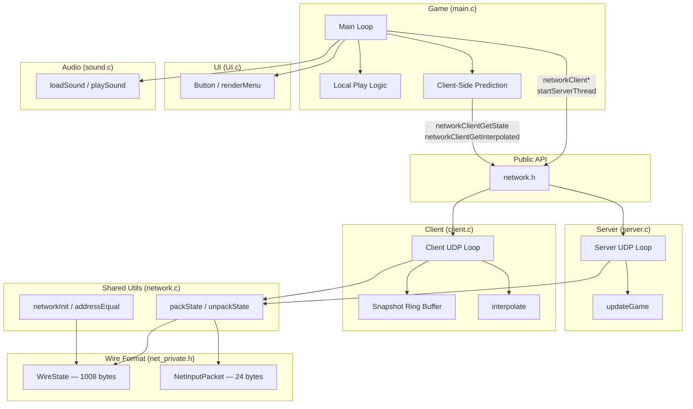
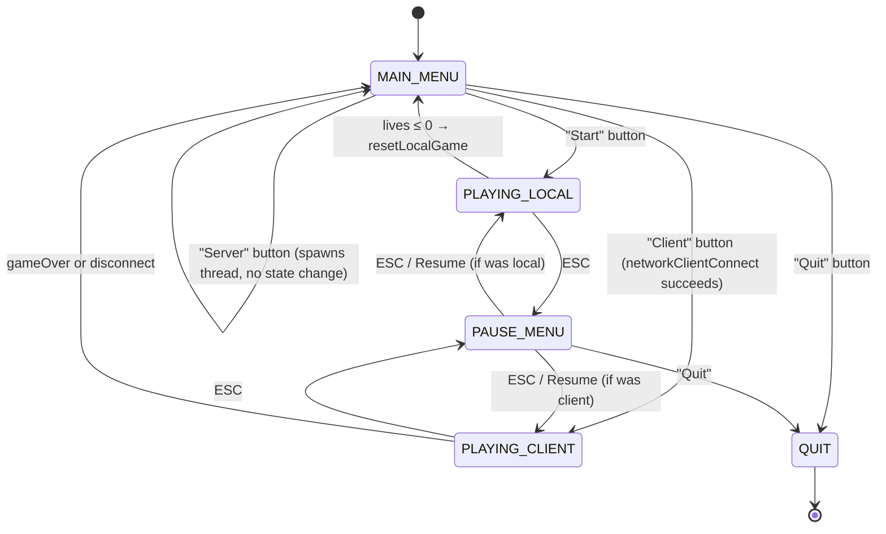
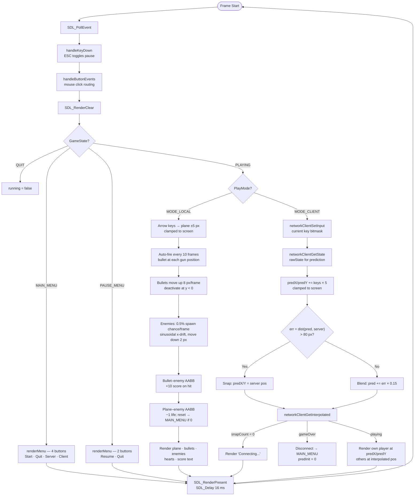
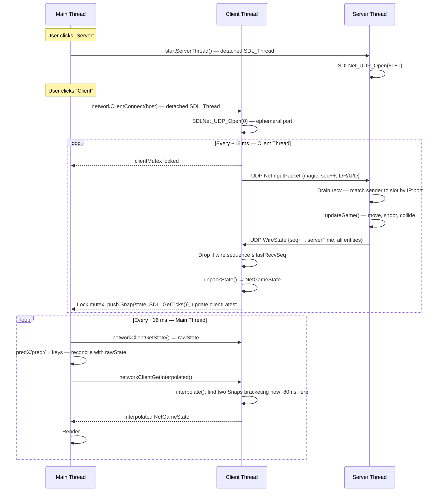
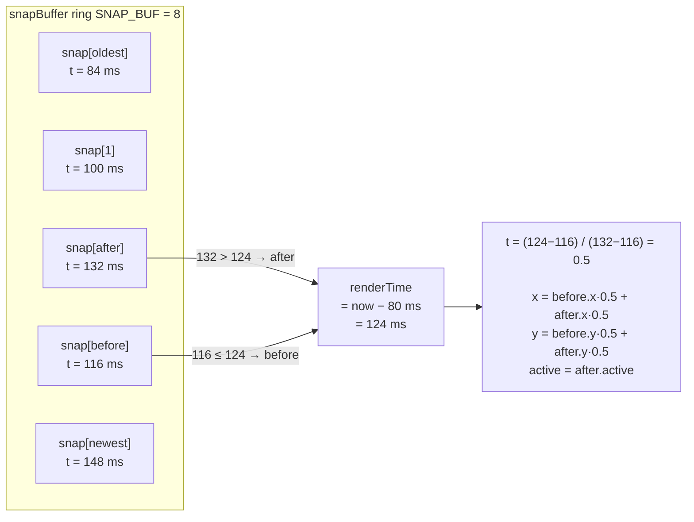
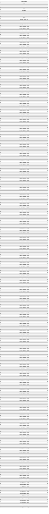

# Architecture

## 1. Module Dependencies

---

## 2. Game State Machine

---

## 3. Main Loop — Per-Frame Flow

---

## 4. Three-Thread Network Flow

---

## 5. Snapshot Interpolation

---

## 6. UDP Wire Format

> `WireObj` = `Sint16 x` + `Sint16 y` + `Sint32 active` = **8 bytes**
> Total `WireState` = **1008 bytes** (fits in one UDP datagram; old TCP format was ~1492 bytes)
